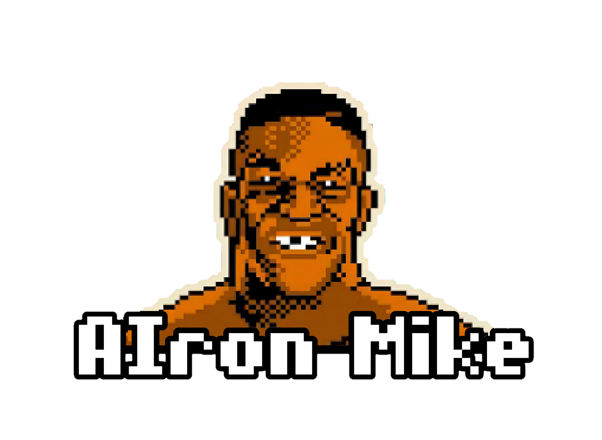

# AIron Mike 🥊

  

📁 Data          → Contains the raw dataset and preprocessed data;

📁 Demo          → Contains the demo of the project;

📁 Documents     → Contains the documentation;

📁 Scripts       → Contains scripts that cover all phases of the project, from data visualization and preprocessing, to model training and evaluation.;

## Table of Contents 📋
* [General Information](#General-Information-ℹ)
  + [Project Goal](#Project-Goal-)
* [Features](#features-)
* [Technologies used](#Technologies-used-)
* [Utilizzo](#utilizzo-)
* [Project Status](#project-status-)

## General Information ℹ
This project focuses on analyzing a comprehensive dataset of boxing matches, which includes detailed information about the fighters, match outcomes, and various metrics such as height, weight, reach, stance, and knockout records. The dataset contains over 300,000 records, offering a wealth of information on historical boxing events. The data has been thoroughly processed to handle missing values, outliers, and categorical variables to ensure optimal analysis.
### Project Goal 🎯
The main goal of this project is to develop a robust predictive model capable of forecasting the outcome of boxing matches based on fighter characteristics and past performance. By exploring and preprocessing the dataset, the project aims to uncover the relationships between various factors (e.g., fighter's height, weight, age, and stance) and their influence on the match result. The ultimate objective is to provide a data-driven approach to understanding what factors contribute to winning a boxing match.

## Features 📝
The project pipeline covers several key stages:
- Data Understanding: A detailed exploration of the dataset, including summary statistics, correlation analysis, and visualization of distributions.
- Data Preprocessing: Managing missing values, handling outliers, imputing critical fighter statistics, and encoding categorical variables to prepare the data for modeling.
- Feature Engineering: Creating and selecting relevant features that provide meaningful input for the model.
- Predictive Modeling: Training machine learning models to predict match outcomes, and evaluating their performance using validation and testing sets.

This project aims to support sports analysts, trainers, and enthusiasts by offering insights into the critical elements of fight outcomes and making data-informed predictions.

## Technologies used 📊
- Python
- Seaborne
- Numpy
- Matplot
- Scikit - Learn
- Pandas

## Project Status
The Project is: **_In Progress_**. 🚧
